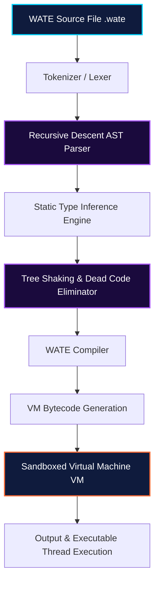

# ⚡ WATE Programming Language

> **Modern scripting language powered by AST parsing, bytecode VM, sandboxed runtime permissions, LSP support, REPL, and WPM package manager.**

<div align="center">

[](#)
[](#)
[](#)
[](#)

</div>

---

## 🌟 What is WATE?

**WATE** (Waseem Akram Transcription Engine) is an elegant, secure, and production-ready programming language. It delivers top-tier performance by utilizing a hybrid design of transpilation and virtual machine execution. WATE bridges the gap between high-level development speed and low-level runtime control.

### Key Highlights:
- 🚀 **Built-in Web Framework:** Robust, native HTTP routing system with route parameter bindings and middleware.
- 🔒 **Sandboxed Permission Engine:** Node/Deno-like runtime permission guards (`--allow-net`, `--allow-read`, `--allow-write`, `-A`).
- 🗄️ **Multi-Driver Database Layer:** Native support for SQLite, PostgreSQL, MySQL, MongoDB, and JSON storage out-of-the-box.
- 🤖 **Native Web Automation:** Dynamic browser automation (headless navigation and web scraping) via the `bot` package.
- 📦 **WPM Package Manager:** Instantly install 12 high-performance pre-bundled standard libraries offline.
- 🧩 **Developer-First DX:** Custom VS Code language extension with 20+ ready-to-use snippets, syntax highlighting, and active LSP autocompletion.

---

## 🏗️ Architecture

WATE uses a highly optimized compile and run pipeline. It converts source code into a highly structured AST, performs static type check passes, tree-shakes unused methods, compiles to bytecode, and interprets it inside a secure virtual machine sandbox.



### ASCII Representation:
```
┌─────────────────────────────────────────────────────┐
│                  WATE Source (.wate)                │
└───────────────────────┬─────────────────────────────┘
                        │
                        ▼
┌─────────────────────────────────────────────────────┐
│         Recursive Descent AST Parser                │
│   • Tokenizer → Token Stream → AST Nodes            │
│   • Caret Diagnostics (line, column, error-highlight)│
└───────────────────────┬─────────────────────────────┘
                        │
                        ▼
┌─────────────────────────────────────────────────────┐
│              Bytecode Compiler / VM                  │
│   • AST → Bytecode Instructions                     │
│   • Static Type Inference Engine & Warnings         │
│   • Tree Shaking (Dead Code Elimination)            │
└───────────────────────┬─────────────────────────────┘
                        │
                        ▼
┌─────────────────────────────────────────────────────┐
│               Sandboxed Runtime                     │
│   • Permission guards: --allow-net, --allow-read    │
│   • Multi-thread workers pool                       │
│   • Hot Reload watcher (--watch)                    │
└─────────────────────────────────────────────────────┘
                        │
               ┌─────────┼─────────┐
               ▼         ▼         ▼
          WPM (pkg)  LSP Server  REPL
          12 pkgs    VS Code     Interactive
```

---

## ⚙️ Installation Guide

### Option 1: Automatic Installer (Windows - Highly Recommended)
1. Download `WATE_Setup_v1.0.0.exe` from the latest **[GitHub Releases](https://github.com/waseem3423/wate/releases)** page.
2. Run the installer. It will:
   - Configure paths in your system environment variable `PATH`.
   - Setup global executable aliases for `wate` and `wpm`.
   - Setup custom file associations so `.wate` files show a premium branded WATE icon.
   - Automatically register the VS Code, Cursor, Windsurf, and Antigravity extensions.
3. Open a terminal and run:
   ```powershell
   wate version
   wpm --help
   ```

### Option 2: Building from Source
If you wish to compile the binaries manually from source code:
1. Ensure Node.js (v18+) is installed.
2. Clone the repository and install global packaging requirements:
   ```bash
   git clone https://github.com/waseem3423/wate.git
   cd wate
   npm install -g pkg
   ```
3. Compile the standalone executables:
   ```bash
   # Compile WATE Engine
   pkg wate.js --targets node18-win-x64 --output wate.exe

   # Compile WPM Package Manager
   pkg wpm.js --targets node18-win-x64 --output wpm.exe
   ```

### Option 3: Manual VS Code Extension Setup
To install the developer highlighting & snippets manually:
```bash
code --install-extension wate-vscode/wate-lang-2.0.0.vsix --force
```

---

## 🚀 Quick Start

Create a file named `hello.wate` and paste the following snippet:

```wate
# hello.wate
fn greet(name) {
    return f"Hello, {name}! Welcome to WATE ⚡"
}

set developers = ["Waseem", "Antigravity", "World"]
for dev in developers {
    out(greet(dev))
}
```

Now, run the script from your terminal:
```bash
wate hello.wate
```

**Output:**
```
Hello, Waseem! Welcome to WATE ⚡
Hello, Antigravity! Welcome to WATE ⚡
Hello, World! Welcome to WATE ⚡
```

---

## 📦 WPM Package Manager

WATE is equipped with **WPM**, a dedicated standard library package manager. WPM allows you to seamlessly fetch and configure robust system modules instantly:

| Module | Category | Description |
|:---|:---|:---|
| 🌐 `web` | Server | Full Web framework with routing, middleware, and request/response abstraction. |
| 🤖 `bot` | Automation | Browser automaton API for headless navigation, testing, and scraping. |
| 📂 `db` | Database | Zero-dependency Document-based JSON database with automatic file persistence. |
| 🧠 `ai` | AI Integration| Deep Gemini-style API bindings to query large language models dynamically. |
| 💾 `sqlite` | Database | Embedded, high-performance database client module. |
| 🐘 `postgres`| Database | PostgreSQL connection client supporting transactions. |
| 🐬 `mysql` | Database | MySQL database engine module supporting connection pooling. |
| 🍃 `mongodb`| Database | NoSQL MongoDB database driver. |
| 📊 `csv` | Utility | Fast CSV generator and parsing module. |
| 📈 `excel` | Utility | Programmatically read, edit, and write native `.xlsx` workbooks. |
| 📄 `pdf` | Utility | Rich vector PDF rendering engine for standard report sheets. |
| 🖼️ `image` | Utility | Manipulate, resize, crop, and convert graphics programmatically. |

### WPM Commands:
```bash
wpm install web        # Install Web Framework
wpm install sqlite     # Install SQLite Client
wpm list               # View all installed modules
wpm remove web         # Uninstall a module
```

---

## 📁 Examples Folder & Code Snippets

For hands-on coding, explore the **[examples](./examples)** directory where you'll find ready-to-run configurations:
- 🏢 [Enterprise Ecosystem Showcase (Phase 4)](./examples/enterprise.wate)
- 🌐 [HTTP Server Example](./examples/server.wate)
- 💾 [SQLite Query Operations](./examples/database.wate)
- 🤖 [Web Scraper Automation](./examples/automation.wate)
- ⏰ [Task Scheduler Daemon](./examples/scheduler.wate)
- 🚀 [Hello World Entrypoint](./examples/hello.wate)

---

## 📖 Deep Language Demos

### 1. Object-Oriented Interface Guard
```wate
interface Printable {
    method printDetails;
}

class Product implements Printable {
    init(title, price) {
        this.title = title
        this.price = price
    }

    printDetails() {
        out(f"Product: {this.title} | Price: ${this.price}")
    }
}

set item = Product("WATE Manual Book", 49.99)
item.printDetails()  # => Product: WATE Manual Book | Price: $49.99
```

### 2. Sandbox Permissive Guarding
```wate
# Execute script with strict access controls
# CLI: wate run secure.wate --allow-read

set source = file.read("config.json")       # ✅ Granted successfully
set request = http.get("https://google.com") # ❌ Exception: WATE Permission Denied!
```

### 3. Task Scheduler & Timer
```wate
# Heartbeat check runs every 5 seconds
set check = every("5s", fn() {
    out(f"🚀 [Daemon Logger] System health status green at {date.time()}")
})
```

---

## 🗺️ Product Roadmap

| Goal Status | Title | Description |
|:---:|:---|:---|
| 🟢 **Stabilized** | AST Engine & Lexer | Custom recursive descent syntax compilation. |
| 🟢 **Stabilized** | Bytecode VM Interpreter | Sandboxed low-overhead execution shell with register VM option. |
| 🟢 **Stabilized** | Caret Error Pointer | Visual highlighting of syntax errors with exact column diagnostics. |
| 🟢 **Stabilized** | WPM Package System | Dependency manager with offline fallbacks and integrity hashing. |
| 🟢 **Stabilized** | Extension Snippets v2.1.0| Syntax configuration and DAP integration for VS Code & Cursor. |
| 🟢 **Stabilized** | Auto Test Runner & Coverage | Test suite runner with statement & branch code coverage (`wate test --coverage`). |
| 🟢 **Stabilized** | Syntax Linter (`wate lint`) | Code style, unused variable & dead code analysis with rich diagnostics. |
| 🟢 **Stabilized** | Code Formatter (`wate fmt`) | Go-style automatic source code formatter with `--check` and `--write`. |
| 🟢 **Stabilized** | Benchmarking Suite (`wate bench`) | High-precision micro-benchmark runner with ops/sec and latency percentiles. |
| 🟢 **Stabilized** | Application Bundler (`wate bundle`) | Single-file application & package dependency bundler. |
| 🟢 **Stabilized** | Native Compiler (`wate compile --exe`) | Compiles WATE scripts into standalone 64-bit native `.exe` binaries. |
| 🟢 **Stabilized** | Package Security Auditor (`wpm audit`) | Vulnerability scanner detecting dangerous permissions and unsafe patterns. |
| 🟢 **Stabilized** | Cloud Registry (`wpm publish`) | Centralized package publishing with SHA-256 checksums. |
| 🟢 **Stabilized** | Interactive CLI Debugger & DAP | Breakpoints, step-over, step-into, inspect (`wate debug`, `wate --dap`). |
| 🟢 **Stabilized** | Automated Docs Server (`wate doc`) | Live markdown/HTML docs generator with built-in HTTP server (`--serve`). |
| 🟢 **Stabilized** | WATE Web Playground | Browser-based execution sandbox with shareable cloud URL hashes. |

---

## 📄 License
WATE is open-source software licensed under the **[MIT License](./LICENSE)**.

---
<div align="center">
Built with ❤️ by <b>WazemTech (Waseem Akram)</b>. Give WATE a ⭐ on GitHub!
</div>
